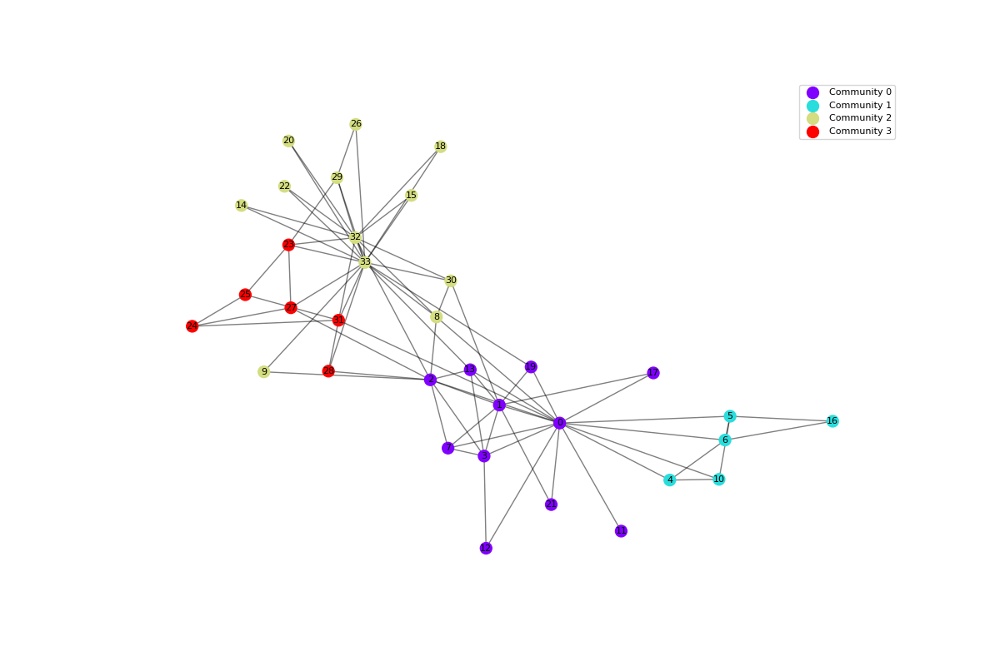

<div align="center">
   

   <strong>rapid evolutionary multi-objective community detection</strong>


[](https://pypistats.org/packages/re_mocd)

<hr>

</div>


> **Warning:**  
>
> This project is in its early stages, and the algorithm is still being refined. Performance and results may not be optimal yet.

## Overview

This project aims to develop a high-performance genetic algorithm in Rust to detect communities in a graph. The goal is to optimize the community detection process to handle large-scale graphs efficiently. This algorithm also tries to handle some problems that happens with louvain algorithm.

> **Why Rust?**  
>
> Rust is one of the fastest programming languages available, offering high-performance execution and memory safety without a garbage collector. It has a rich ecosystem of libraries.

## Usage

### Requirements

Before running the algorithm, you'll need an edge list file formatted as follows:

```plaintext
0,1,{'weight': 4}
0,2,{'weight': 5}
0,3,{'weight': 3}
...
0,10,{'weight': 2}
```

The **weight** attribute is optional. If not provided, it can be represented by an empty dictionary: `{}`. You can save a `networkx` graph like this with: `networkx.write_edgelist(G, file_path, delimiter=",", data=False)`

### Installation via PyPI

The library is available on PyPI. You can install it using `pip`:

```bash
pip install re-mocd
```

#### Simple Example (Python)

Here's a simple example of how to use the library in Python, the function return a dict of the partition found:

```python
import re_mocd

edgelist_file = "res/graphs/artificials/article.edgelist"
partition = re_mocd.run(edgelist_file)
```

You can see an [example of plotting](res/example.py), or an example of how to [make comparisons](res/example.py) with other algorithms in `res/`.

<center>



</center>

### Running from Scratch

#### Build and Run

1. Clone the repository and navigate to the project folder:
   ```bash
   git clone https://github.com/0l1ve1r4/re_mocd
   cd re_mocd
   ```

2. Compile and run the algorithm with your edge list file:
   ```bash
   cargo run --release mygraph.edgelist
   ```

#### Debug Mode

To run the algorithm in debug mode, use the `-d` flag:
```bash
cargo run --release mygraph.edgelist -d
```

This will provide additional debug output, useful for troubleshooting and monitoring the algorithm's progress.